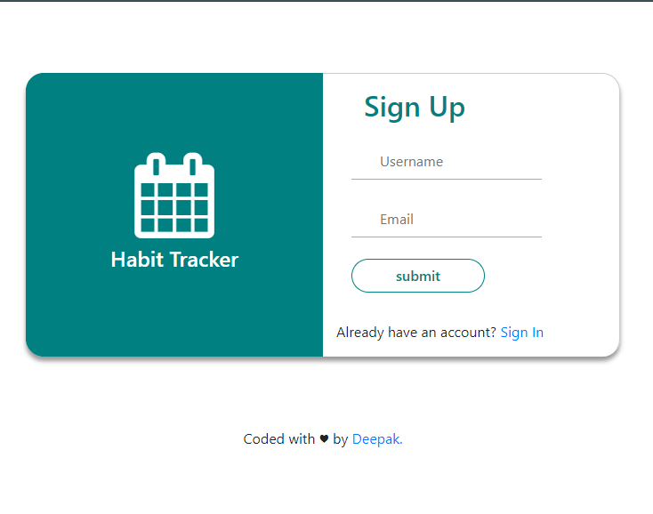
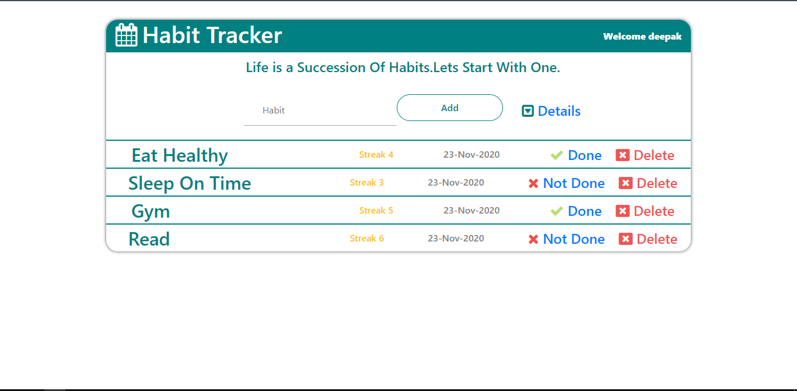
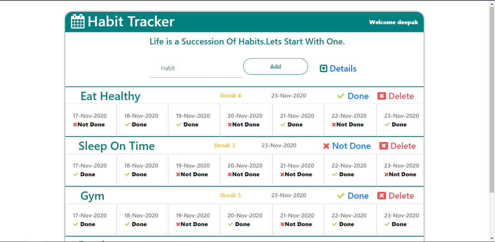
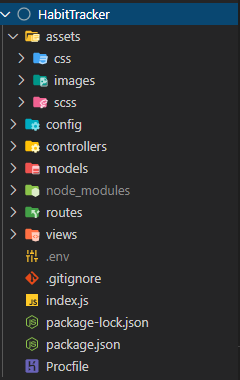

# HabitTracker
Habit tracker made using nodejs and express.
## [`Habit Tracker Demo`](https://habittracker-node.herokuapp.com/)
## Features
<ul>
  <li>User Signup/Signin.</li>
  <li>Track each habit everyday.</li>
  <li>Habits detail week view.</li>
  <li>Habit Streak.</li>
</ul>

<h2>Sign-Up/Sign-In Page</h2>

<h2>Dashboard</h2>

<h2>Detail Dashboard</h2>

<h2>File Structure</h2>

<h3>Credits:-</h3>
<a href="https://github.com/moment/moment/">Moment.js</a>
 
<a href="https://github.com/marcuswestin/store.js#readme">Store.js</a>
 
<a href="https://github.com/twbs/bootstrap">bootstrap</a>
